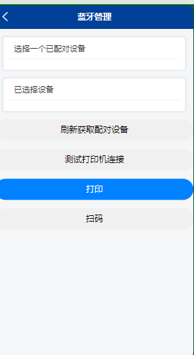

# 基于安卓webview

使用安卓 webView 打包 H5 并整合蓝牙打印 适配 ZR308 支持CPCL ZPL 等

同时适配了普通的二维码 扫描 ，并集成了自动更新功能

#### 编译器
(Android Studio)[https://developer.android.com/studio]
下载后将本项目导入，使用gradle 进行编译 

### 主要功能
## 蓝牙打印：通过蓝牙连接，实现快速、稳定的打印输出。
eg :
  - 打印cpcl
  - js.printCPCL(data)

  注：data必须符合cpcl规范
## ZPL 支持：兼容 ZPL 打印语言，满足多样化的打印需求。
- js.printZPL(data)
 data 需要为标准的zpl语言

## ZPL 扫码：能够快速准确地扫描和识别 ZPL 格式的条码。
目前扫码适配了zebra 和idata 部分型号
更多型号正在适配中
## 编程支持：可以编成 arr 包，方便进行定制化开发和集成。

## 一、项目概述
本项目致力于开发一款功能强大的蓝牙打印应用，适配了 CPCL 和 ZPL 打印语言，并支持多种扫码设备型号，如 Zerbal、Idata 等。同时，还集成了自动更新能力，以确保用户始终能够享受到最新的功能和优化。

## 二、主要功能
蓝牙打印：
支持通过蓝牙与多种打印机设备建立稳定连接，实现无线打印操作。
提供丰富的打印设置选项，包括打印纸张大小（如 A4、A5 等）、打印方向（横向、纵向）、打印质量（高、中、低）等，以满足不同的打印需求。
能够处理各种类型的打印内容，如文本、图像、表格等，并确保打印输出的清晰度和准确性。
支持批量打印，用户可以一次性选择多个文件或任务进行连续打印，提高工作效率。
具备打印预览功能，在打印之前用户可以查看打印效果，如有需要可进行调整和修改。
CPCL 和 ZPL 适配：兼容 CPCL 和 ZPL 打印语言，满足不同打印格式的需求。
扫码设备支持：适配 Zerbal、Idata 等多种扫码设备型号，实现快速准确的扫码操作。
自动更新：应用具备自动检测和更新的功能，无需用户手动操作，始终保持最新版本。
## 三、技术架构
采用[具体技术框架]实现蓝牙连接和数据传输。
利用[特定的解析库]处理 CPCL 和 ZPL 打印指令。
通过[相关的驱动或接口]与扫码设备进行通信和数据采集。
## 四、安装与使用
安装：
从[指定的下载渠道]获取安工具装包或自行编译。
按照安装向导的提示进行操作。
使用：
打开应用程序。
开启蓝牙功能，搜索并连接可用的打印设备和扫码设备。
根据具体需求选择打印或扫码操作，并进行相应的设置。
## 五、系统要求
操作系统：[目前只适配Android]
蓝牙版本：[最低要求的蓝牙版本4.0]
## 六、自动更新
应用会在启动时自动检查是否有可用的更新。
若有更新，将提示用户并在用户同意后自动下载和安装。
## 七、常见问题与解决方法
蓝牙连接失败：
确保设备蓝牙已开启且在有效范围内。
重新启动设备和应用尝试连接。
打印异常：
检查打印指令是否正确。
确认打印机设置和纸张规格是否匹配。
扫码无法识别：
清洁扫码设备镜头。
确保扫码环境光线充足。
八、联系方式
如您在使用过程中遇到任何问题或有任何建议，请通过以下方式联系我们：
电子邮件：[254856090@qq.con]

